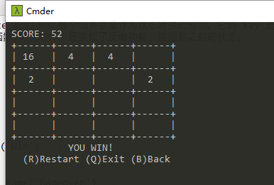

## 用python实现2048游戏  

### 1.依赖库  
	import curses  
	from collections import defaultdict  
	from random import randrange, choice  

### 2.游戏主逻辑的状态转换（FSM）  
  
state 存储当前状态， state_actions 这个词典变量作为状态转换的规则，它的 key 是状态，value 是返回下一个状态的函数,除此之外，还实现了反悔功能，能回到之前的状态。

* Init: init()  
	* Game  
* Game: game()  
	* Game  
	* Win  
	* GameOver  
	* Exit  
* Win: lambda: not_game('Win')   
	* Init  
	* Exit  
* Gameover: lambda: not_game('Gameover')  
	* Init  
	* Exit  
* Exit: 退出循环  

	状态机会不断循环，直到达到 Exit 终结状态结束程序。  

### 3.游戏截屏  
  
  

